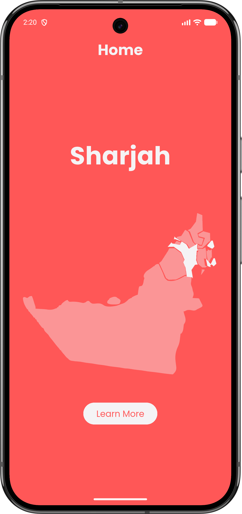
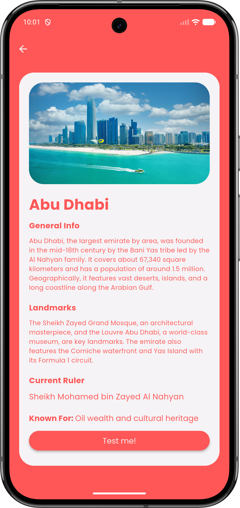
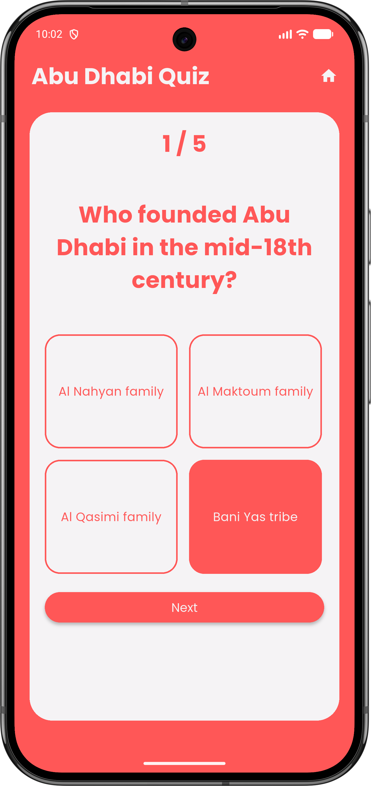
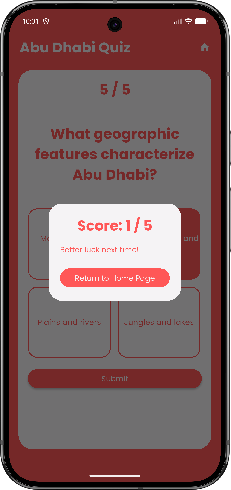

# UAE GeoQuest

A mobile-first Flutter app that teaches users about the seven Emirates of the UAE and tests their knowledge with a quiz.

**Live demo:** https://ssimplistic.github.io/uae-geoquest/

## Screenshots

Home Page | Emirate information | Quiz question | Results |
|---|---|---|---|
|  |  |  |

## Features

- Home page: Select an emirate from a map of the UAE, and click Learn More to view information about the selected emirate.
- Each of the 7 Emirates has an information page containing the following: General Info (size, history, geographical features), Landmarks, Current Ruler, and something the emirate is Known For.
- Quiz mode: 5 questions, multiple choice, instant feedback and final score given after answering the last question
- Designed for mobile screens, also runs in the browser as a Flutter web build

## Tech Stack

- Flutter / Dart
- Packages: flutter_lints, flutter_svg, google_fonts, cupertino_icons
- Data: Hardcoded in constants.dart file
- Deployment: Flutter web build hosted on GitHub Pages

## Running Locally

```bash
git clone https://github.com/SSimplistic/uae-geoquest-source.git
cd uae-geoquest-source
flutter pub get
flutter run
```

Requires Flutter 3.0.0 or later. Run `flutter --version` to check yours.

## Author

Muhammad Imran Mikhael
